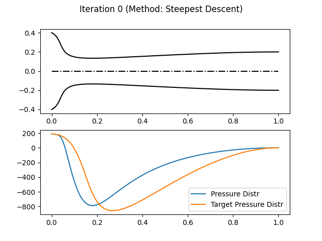
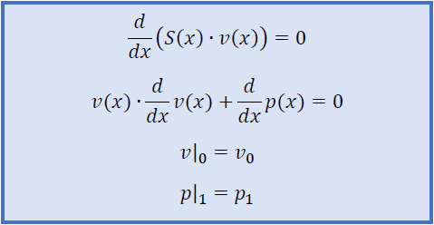
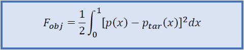
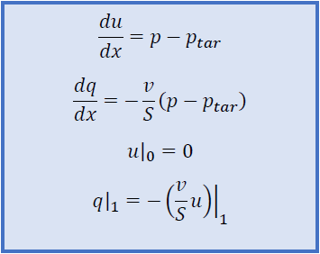
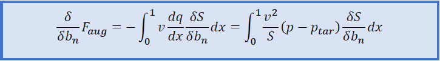
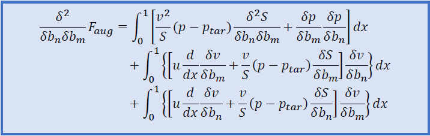
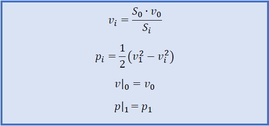
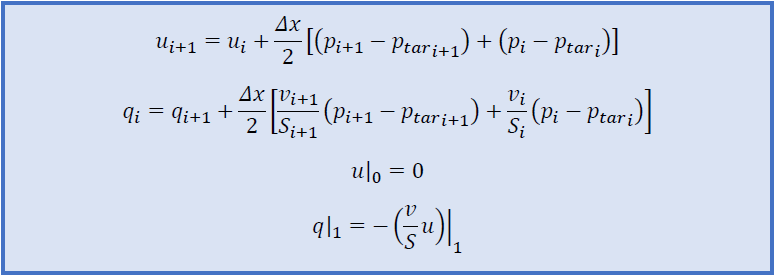
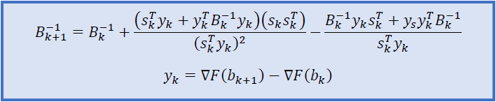

# Nozzle Geometry Optimization

Object of the project is the optimization of geometry of a nozzle. For this purpose gradient based optimization methods 
like Steepest Descent, Newton's Method and BFGS, have been developed. For this application quasi-one-dimensional flow has
been considered.

  

## Mathematical Formulation

### Governing Equations

The governing equations that describe the quasi-one-dimensional flow inside the nozzle are the following.
The inlet velocity is given. The length of the nozzle has been nondimensionalized.

Considering that S(x) is the area of the cross-section that is at a distance x from the inlet of the nozzle and v(x) is
the velocity of the fluid at any given cross-section then the governing equations are the following.

  

The objective function  we want to minimize is the following. P_tar is the given target pressure distribution.

  

### Nozzle's Generatrix Parameterization

The nozzle is parameterized as a Bezier spline which produces the nozzle by revolution. The design variables are
the spline's contol point coordinates.

### Adjoint Equations

The parameterized generatrix is consisted of about n control points (about 5 to 10 cp), which means we have to define 
2(n-2) design variables (x and y coordinates of each cp minus the boundary cps). In order to apply the gradient-based 
optimization methods we need to calculate the derivatives of the objective function with respect to each design 
variable. Calculating these derivatives with central finite differences would mean solving the flow 4(n-2) times which 
is compuationally inefficient (in other CFD cases which have more than 100 design variables this cost would be 
intolerable). In order to avoid this computational cost we use the adjoint method, which calculates those derivatives
solving only two additional ODEs (the primal equations need to be solved either way).

Setting the augmented objective function and applying the operations, we get the following adjoint equations.

  

Sensitivity Derivatives have the following form.

  

### Direct Derivation - Adjoint Derivation (DD-AV)

Newton's Method which will be used in this application makes use of the Hessian matrix, which consists of second 
derivatives of the objective function with respect to the design variables. In order to calculate those derivatives
efficiently we use the DD-AV method, which means that first we get the derivatives with direct derivation, and then we
apply the adjoint method. The second order sensitivity derivatives have the following form.

  

## Discretization

### Primal Equations

Solving the primal ODEs and applying discretization we get the following.

  

### Adjoint Equations

Applying central differences to the adjoint equations we get the following.

  

## Gradient Bazed Optimization

### Steepest Descent Method

Steepest Descent Method uses the gradient in order to calculate the new vector of design variables.

  

The value η can either be constant during all optimization cycles or it can alter.

### Newton's Method

Newton's Method makes use of the Hessian matrix, providing much faster convergence than the steepest descent method. The
new vector of the design variables is calculated as follows.

  

### BFGS Method

BFGS determines the descent direction by preconditioning the gradient with curvature information. It does so
by gradually improving an approximation to the Hessian matrix of the loss function, obtained only from gradient 
evaluations (or approximate gradient evaluations) via a generalized secant method. In order to avoid the computational
cost of the matrix inversion, we calculate the inverse of the Hesseian approximation initially.

  

In every cycle of optimization the search direction is given as follows.

  

With use of a Line Search method, the length of the step a_k and the new vector of the design variables get calculated.

  

## Demo

For the demonstration of the algorithm 3 examples have been conducted. The reason that in no case neither Newton's 
method nor BFGS have been applied by themshelves, without applying Steepest Descent steps, is that the algorithm presents
instabillities due to the tendency of Bezier curve to fold during the procedure. Even so, their much faster convergence
speed is obvious.

### Case 1
* Procedure:
    1. Steepest Descent: 1000 iterations

* Total Iterations: 1000
* Final Value of Objective Function: 88.6058

  

### Case 2
* Procedure:
    1. Steepest Descent: 24 iterations
    2. BFGS: 6 iterations
    3. Steepest Descent: 24 iteration
    4. BFGS Method: 6 iterations
* Total Iterations: 60
* Final Value of Objective Function: 5.2108

  

### Case 3
* Procedure:
    1. Steepest Descent: 5 iterations
    2. Newton's Method: 10 iterations
    3. Steepest Descent: 1 iteration
    4. BFGS Method: 3 iterations
* Total Iterations: 19
* Final Value of Objective Function: 2.4625

  

